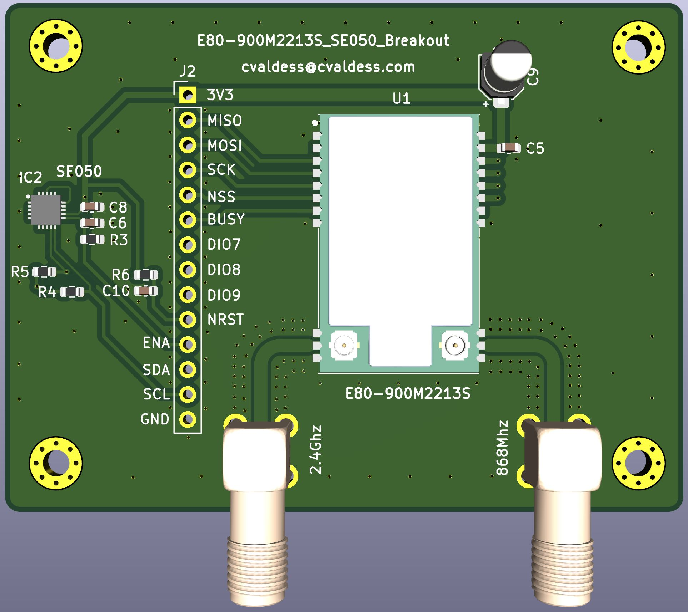
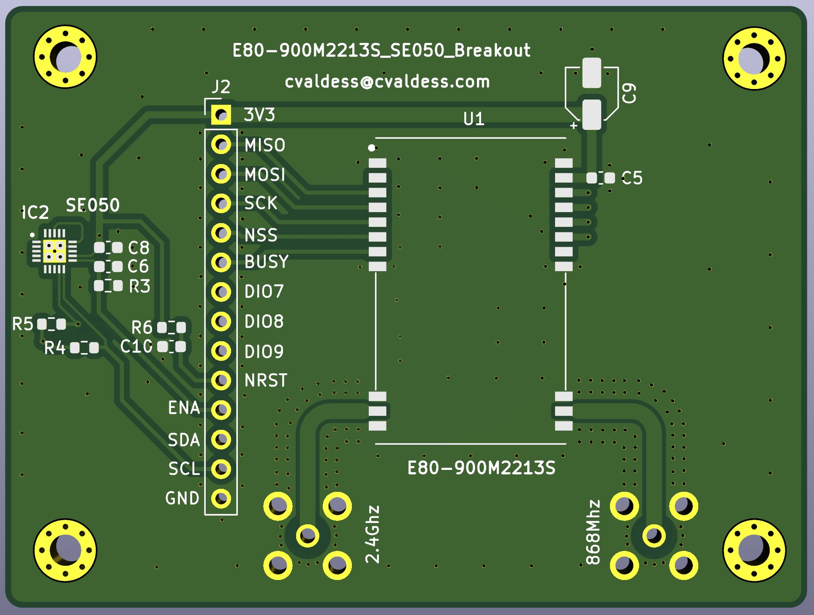

# E80-900M2213S + SE050 Breakout



A breakout board for the **Ebyte E80-900M2213S** dual-band LoRa module (Semtech **LR1121**, sub-GHz
and 2.4 GHz) with an **NXP EdgeLock SE050E2** secure element next to it. The radio's SPI bus and
control lines and the secure element's I²C bus all come out on one 14-pin 2.54 mm header. Each antenna
port has its own right-angle SMA connector, fed by a 50 Ω line.

68.92 × 51.80 mm, two layers, 1.6 mm, four M2.5 mounting holes. Designed in KiCad 10. The project is
self-contained: the symbols, footprints and 3D models of every non-standard part are in [`lib/`](lib/),
so it opens on any machine without installing extra libraries.

> **Status: not fabricated yet.** The design passes DRC, ERC and schematic parity with zero
> violations, but no board has been built or tested. The RF line impedance is calculated, not
> measured. Read [Fabrication](#fabrication) before ordering.

## Made with Claude and Konnect

This board was designed by [cvaldess](https://github.com/cvaldess) with the help of **Claude**
(Anthropic's AI model), working on the KiCad project through
**[Konnect](https://github.com/mixelpixx/Konnect)**, an MCP server that lets an AI agent read,
check and edit KiCad designs through KiCad's own tooling instead of rewriting the files as text.

Claude reviewed the RF layout against the module's manual, reshaped the two antenna feed lines,
checked the design rules, added the 3D models and generated the fabrication files. It did this through
Konnect, together with KiCad's own command-line and Python tools. Commits it co-authored carry its
`Co-Authored-By` line.

## Pinout (J2, 1×14, 2.54 mm pitch)

| Pin | Signal | Connects to | Notes |
|----|--------|-------------|-------|
| 1 | 3V3 | E80 VCC (pin 25), SE050 VIN | the only supply; powers the whole board |
| 2 | MISO | E80 pin 3 | LR1121 SPI |
| 3 | MOSI | E80 pin 4 | LR1121 SPI |
| 4 | SCK | E80 pin 5 | LR1121 SPI |
| 5 | NSS | E80 pin 6 | SPI chip select |
| 6 | BUSY | E80 pin 7 | |
| 7 | DIO7 | E80 pin 24 | LR1121 I/O, see below |
| 8 | DIO8 | E80 pin 23 | LR1121 I/O, see below |
| 9 | DIO9 | E80 pin 22 | LR1121 radio interrupt, see below |
| 10 | NRST | E80 pin 21 | 10 kΩ pull-up and 100 nF to GND on board |
| 11 | ENA | SE050 ENA | **must be driven high**, see below |
| 12 | SDA | SE050 I²C data | 4.7 kΩ pull-up on board |
| 13 | SCL | SE050 I²C clock | 4.7 kΩ pull-up on board |
| 14 | GND | | |

**Pin 9 is the radio's interrupt line, DIO9.** Host code written for SX126x radios often calls
this pin DIO1, but on the LR1121 the interrupt comes out on DIO9 (module pin 22), and the board uses
the module's name. Point your driver's IRQ pin at it.

**DIO7 and DIO8** (module pins 24 and 23) come out on pins 7 and 8. Ebyte's manual lists them as
LR1121 input/output lines and refers to the chip's datasheet for their use. Leave them unconnected if
you don't need them.

**ENA is not optional.** R3 (100 kΩ) pulls it to ground, so the SE050 powers up in deep power-down
and will **not answer on I²C** until the host drives ENA high. If a bus scan finds nothing at
**0x48**, this is the reason. Unlike the standalone
[SE050 breakout](https://github.com/cvaldess/se050-breakout), this board has no solder jumper to
tie ENA high. If you have no GPIO to spare, connect pin 11 to 3V3 externally.

All logic is 3.3 V.

## Board



## Bill of materials

| Ref | Value | Footprint | Purpose |
|-----|-------|-----------|---------|
| U1 | Ebyte E80-900M2213S | 26-position castellated module | LR1121 dual-band LoRa radio |
| IC2 | NXP SE050E2HQ1/Z01Z3Z | HX2QFN20, 3 × 3 mm | secure element |
| SMA1, SMA2 | HJ-SMA175 (LCSC C1509213) | right-angle SMA jack, through-hole | 2.4 GHz and sub-GHz antenna ports |
| C9 | 22 µF / 6.3 V (LCSC C2161824) | aluminium polymer, SMD Ø4 × 5.5 mm | bulk capacitance on the module supply, 200 mΩ ESR |
| C5 | 100 nF | 0603 | module decoupling |
| C8 | 100 nF | 0603 | SE050 VIN decoupling |
| C10 | 100 nF | 0603 | NRST filter |
| C6 | 33 nF | 0603 | ENA filter |
| R4, R5 | 4.7 kΩ | 0603 | I²C pull-ups (SCL, SDA) |
| R6 | 10 kΩ | 0603 | NRST pull-up |
| R3 | 100 kΩ | 0603 | ENA pull-down |
| J2 | 1×14 pin header | 2.54 mm pitch | host connector |
| H1–H4 | — | M2.5, plated, tied to GND | mounting holes |

SMA1 is the **2.4 GHz** port (module pin 12) and SMA2 the **sub-GHz** port (module pin 15, labelled
868 MHz on the silkscreen). Both pin assignments were checked against the drawing in Ebyte's
E80-xxxM2213S user manual.

## Design notes

**RF feed lines.** Both antenna ports use grounded coplanar waveguide on the top layer: a 1.35 mm
track with a 0.35 mm gap to the ground pour, with ground poured on both layers and stitched with via
fences along each line. On the stack-up declared in the project (1.6 mm, 1.51 mm core, εr 4.5) that
works out at about 49.5–55 Ω, depending on the calculation model. Each line leaves the module's
antenna pad through a short 0.8 mm neck (the pad is narrower than the line), runs straight, turns
through a single tangent arc of 2 mm radius, and runs straight into the SMA centre pin.

**Clearances come from rules, not from hand edits.** The ground pour is set to the 0.35 mm RF gap.
A custom rule in [`E80-900M2213S_SE050_Breakout.kicad_dru`](E80-900M2213S_SE050_Breakout.kicad_dru)
moves it back to 0.5 mm from everything else. A second rule opens a 1.0 mm anti-pad around the SMA
centre pins on both layers, which reduces the capacitance of the through-hole transition. If you change
the gap, refill the zones before plotting. `kicad-cli pcb drc --refill-zones --save-board` does it
from the command line with the project's own rules.

**The SE050 circuit is the one from [se050-breakout](https://github.com/cvaldess/se050-breakout)**,
where an earlier revision was built and validated on hardware. VOUT and VCC are tied together with no
capacitor, RST_N goes to ground and the ISO7816 pins are left unconnected. The reasons for each of
these are in that repository's design notes. The exposed pad goes to ground through the same five
0.3 mm vias, one in the centre and one under each of the four paste windows. What is different here:
0603 passives, no ENA jumper, and the I²C pull-ups share the header with the radio.

**Module footprint.** The E80 has 26 positions but only 22 pads (positions 9, 10, 17 and 18 do not
exist). The footprint in `lib/` follows Ebyte's drawing. If you start from Ebyte's own Altium library
instead, note that its pin labels belong to a different, UART-based module. They were corrected here
against the user manual and moved to the fabrication layer.

**3D models.** The SMA model is the manufacturer's STEP file, positioned from its own geometry and
checked against the connector's datasheet (6 × 6 mm body, 17 mm long, 9.5 mm high with 3.3 mm pins).
The thread overhangs the bottom edge of the board.

## Fabrication

Everything a board house needs is in [`gerber/`](gerber/), and the same files are zipped in
[`E80-900M2213S_SE050_Breakout_gerber.zip`](E80-900M2213S_SE050_Breakout_gerber.zip) for upload:

- Gerber X2 for both copper layers, both solder masks, the top silkscreen, both paste layers and the
  board outline, plus the Gerber job file
- Excellon drill files, plated and non-plated separately, with drill maps

There is **no bottom silkscreen**. All 297 holes are plated (237 of them are 0.3 mm vias). The
smallest track and clearance are 0.2 mm, which is within any standard two-layer service.

**Before ordering, check the RF gap against your fab's stack-up.** The 4.5 permittivity and 1.51 mm
core in the project are generic FR-4 assumptions. Put 1.35 mm / 0.35 mm through your board house's
impedance calculator with the stack-up it actually uses for 1.6 mm two-layer boards. If the result is
far from 50 Ω, change the ground zone's clearance, refill the zones and regenerate the gerbers.

> **Fabrication status, precisely.** This board has not been manufactured. Nothing on it has been
> measured, including the line impedance and the SMA transition, which are analytic estimates only.
> The SE050 section repeats a circuit that has been validated on another board. The radio section has
> not been validated. Treat a first order as a prototype run. There is no pick-and-place or assembly
> BOM file yet.

## Repository layout

```
E80-900M2213S_SE050_Breakout.kicad_pro / .kicad_sch / .kicad_pcb
E80-900M2213S_SE050_Breakout.kicad_dru      custom clearance rules for the RF section
sym-lib-table / fp-lib-table                 project library tables, pointing into lib/ via ${KIPRJMOD}
lib/                                         symbols, footprints and 3D models (E80, SE050, SMA)
gerber/                                      fabrication output
E80-900M2213S_SE050_Breakout_gerber.zip      the same fabrication output, zipped
E80-900M2213S_SE050_Breakout-3D.JPG          3D render
E80-900M2213S_SE050_Breakout-2D.JPG          bare board
```

## License

GPL-3.0, see [LICENSE](LICENSE). The 3D models of third-party parts in `lib/` come from their
manufacturers and are included so the project opens complete.
